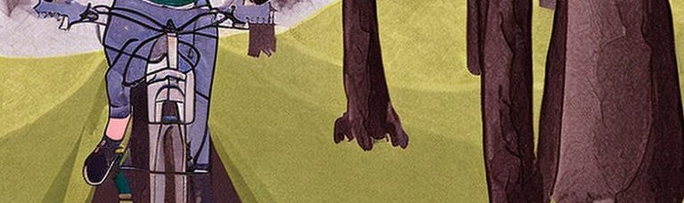
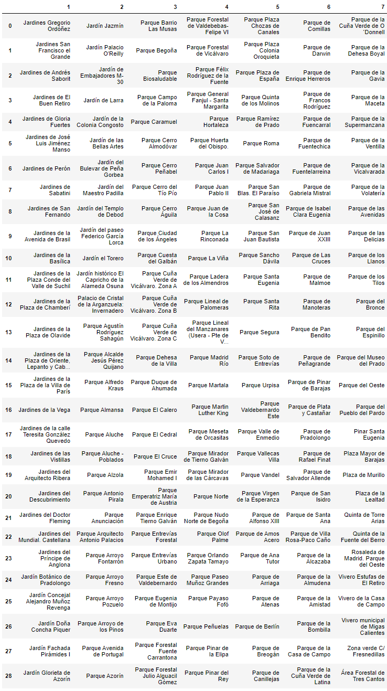
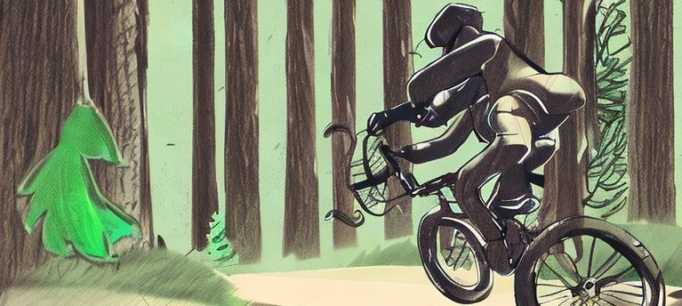
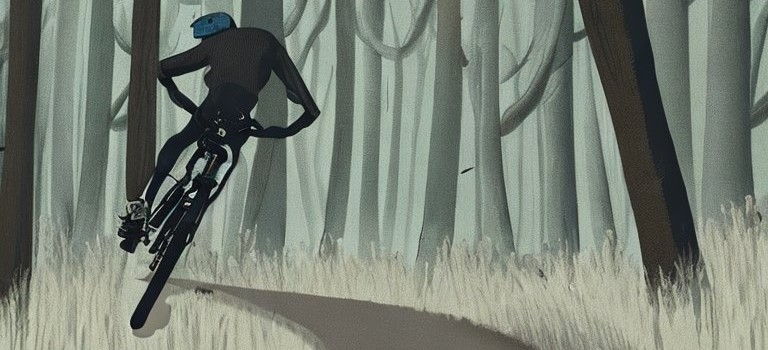

# Proyecto del primer módulo
---

## Status
Beta 1.1
Primer proyecto de ironhack Madrid Febrero 2023!
A falta de hacer el código algo más legible y eficiente.

## One-liner
La aplicación sirve para asignar las estaciones de bicimad más cercanas al parque seleccionado de Madrid o a todos los parques.
incluir captura de los 203 lugares a elegir y algún gráfico

## Technology stack
python                  pandas               numpy
shapely                 matplotlib           geopandas
re                      os                   duckdb
json                    requests

## 💥 Core technical concepts and inspiration
Para visitar parques y jardines de Madrid. Empiezas en uno con una bici de una estación y la dejas en otra estación recorriendo y visitando la ciudad.

## 🔧 Configuration
Descarga de archivos de GitHub:
Main.py
Modules
Data
Power shell python

## 🙈 Usage
Elección de lugar o tipo de lugares de: parques y jardines.
1.- All: para todos los parques y jardines
2.- Lugar específico para bicimad más cercanas.

## 📁 Folder structure

└── project
    ├── __trash__
    ├── .gitignore
    ├── requeriments.txt
    ├── README.md
    ├── main.py
    ├── notebooks
    │   ├── test_main.ipynb
    │   |── final_project1.ipynb
    |   └──...
    ├── modules
    │   ├── geo_calculations    
    │   ├── m_adquisition.py
    │   ├── m_analysis.py
    │   ├── m_reporting
    │   └── m_wrangling
    └── data
        └── images

## 💩 TODO
Pasar readme a inglés. 
Ajustar el argparse. 
Posiblilidad de help con los lugares. 
Acortar tiempos en distancias. 
Ajustar fuente de pdfs. 
Añadir nombre a las filas de los pdfs. 
Un método para cuando se introduzca algo incorrecto. 
Incluir hora de inicio y final. 
Incorporar tres bicimad cuando sea solo un lugar.

## ℹ️ Further info
Links:
[bicimad](https://www.bicimad.com)
[Parques y jardines](https://datos.madrid.es/egob/catalogo/200761-0-parques-jardines.json)

referencias

## 💌 Contact info
email: juanannnnn@gmail.com

